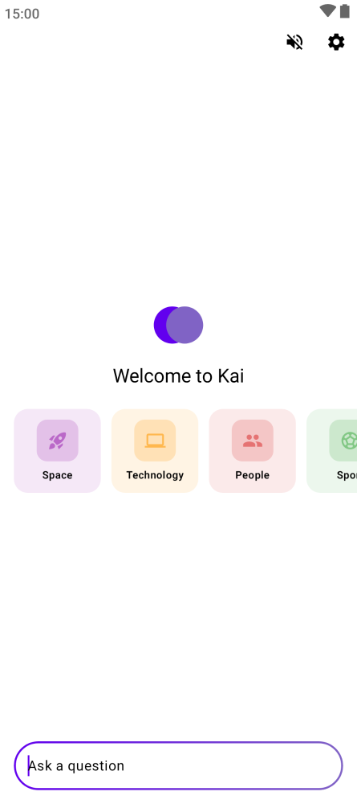
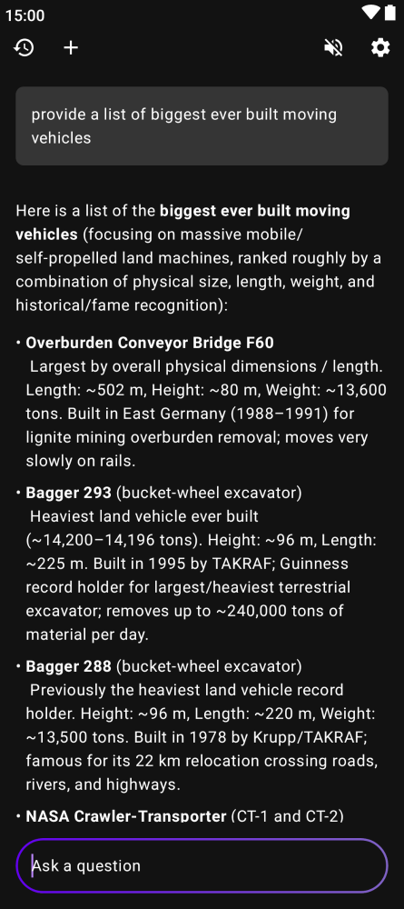
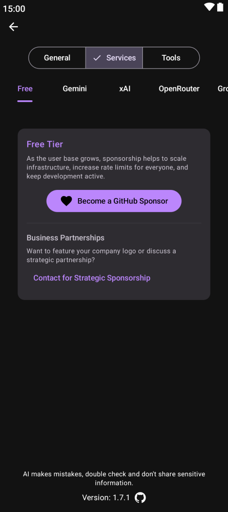
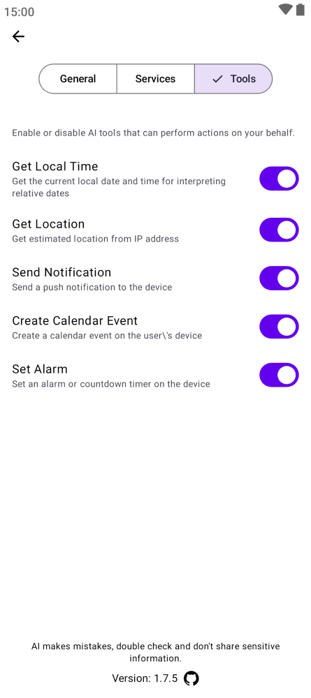
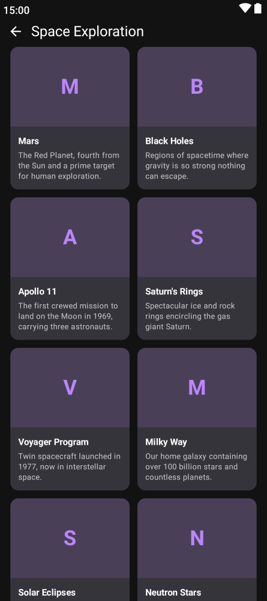

# Kai

   

A **cross-platform open-source AI interface** that runs on **Android, iOS, Windows, Mac, Linux, and Web**.

[](https://apps.apple.com/us/app/kai-ai/id6758148023)
[](https://play.google.com/store/apps/details?id=com.inspiredandroid.kai)
[](https://f-droid.org/en/packages/com.inspiredandroid.kai/)
[](https://simonschubert.github.io/Kai)

Homebrew:
```brew install --cask simonschubert/tap/kai```

### Direct downloads

| Platform | Format | Download |
|----------|--------|----------|
| Android | APK | [GitHub Releases](https://github.com/SimonSchubert/Kai/releases) |
| macOS | DMG | [GitHub Releases](https://github.com/SimonSchubert/Kai/releases) |
| Windows | MSI | [GitHub Releases](https://github.com/SimonSchubert/Kai/releases) |
| Linux | DEB | [GitHub Releases](https://github.com/SimonSchubert/Kai/releases) |
| Linux | RPM | [GitHub Releases](https://github.com/SimonSchubert/Kai/releases) |
| Linux | AppImage | [GitHub Releases](https://github.com/SimonSchubert/Kai/releases) |

### Supported services:

- Ollama: https://github.com/ollama/ollama
- Gemini: https://aistudio.google.com
- xAI: https://x.ai
- Groq: https://groq.com
- Free tier based on Mistral AI: https://mistral.ai

### Features

- Encrypted local history storage
- Text to speech output
- Seamless switch between services
- File attachments (Gemini)

### Tools

All tools can be enabled or disabled in settings.

- **Get Local Time** - Provides the current date and time
- **Get Location** - Estimates location based on IP address for location-aware responses
- **Send Notification** - Sends push notifications to the device (Android only)
- **Create Calendar Event** - Creates calendar events directly from the chat (Android only)
- **Check Recent SMS** - View recent SMS conversations (Android only)
- **Send SMS** - Reply to existing SMS conversations (Android only)

## Screenshots

### Desktop


### Web


### Mobile

     

## Screenshot automatisation

Integrated in github actions to update mobile screenshots for fastlane and this readme. To run manually:

```./gradlew updateScreenshots```

### Supported Languages

Arabic, Bengali, Chinese (Simplified), Chinese (Traditional), Dutch, English, French, German, Gujarati, Hindi, Indonesian, Italian, Japanese, Korean, Malay, Marathi, Persian, Polish, Portuguese, Punjabi, Russian, Spanish, Swahili, Tamil, Telugu, Thai, Turkish, Ukrainian, Urdu, Vietnamese

## Sponsors

This project is open-source and maintained by a single developer. If you find this app useful, please consider sponsoring to help take it to the next level with more features and faster updates.

## Credits

Lottie animation: https://lottiefiles.com/free-animation/loading-wDUukARCPj

GroqCloud: https://groq.com

Gemini: https://gemini.google.com

Mistral: https://mistral.ai/

Ollama: https://github.com/ollama/ollama
